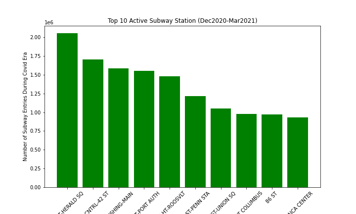
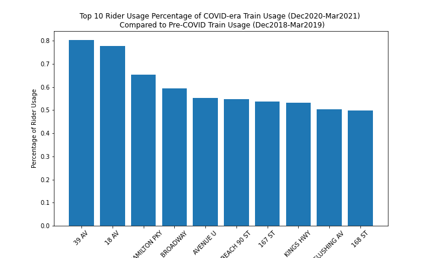

## MTA Turnstile EDA

I aggregated the total subway station entries from a set COVID-era (mid Dec2020 to Mar2021) and a Pre-COVID-era of the same time frame (mid Dec 2018 to Mar2019).

The high-traffic stations from the Pre-COVID have remained the same respective volume during COVID. 

Top 10 Used Stations Pre-Covid :

Top 10 Used Stations Covid Era:

I then compared the COVID usage to the Pre COVID usage and found many outer borough neighborhoods are closer to the Pre-COVID era usage. 

This percentage will help us identify which neighorhoods are closer to their Pre-COVID usage and by incorporating different demographic datasets we can get a better makeup of who is using the trains as a necessity.
